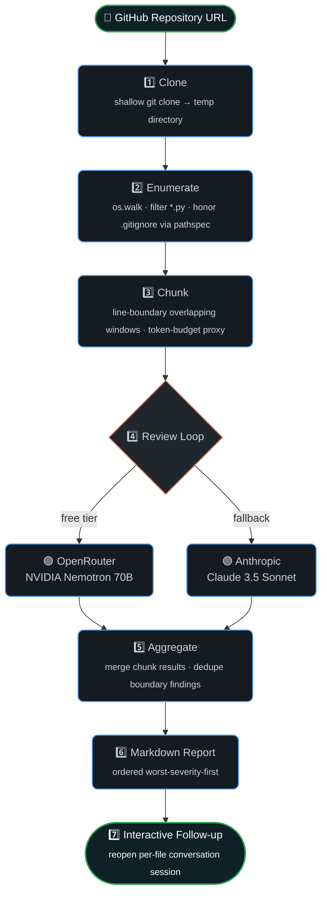
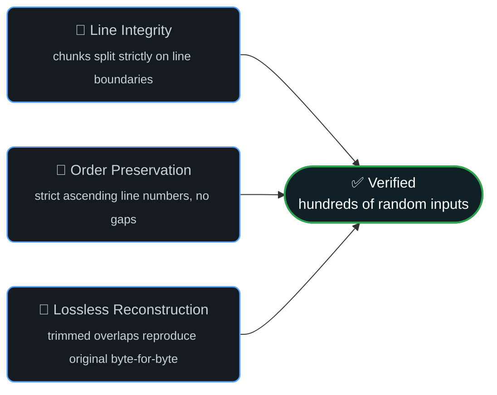

<div align="center">


<br/><br/>


<br/><br/>

[](https://www.python.org/)
[](LICENSE)
[](https://openrouter.ai/)
[](https://www.anthropic.com/)
[](#-testing)
[](#-cross-platform-setup-guide)
[](CONTRIBUTING.md)

<sub>⭐ If this project saves you a code review, consider starring it — it genuinely helps.</sub>

</div>

<br/>

> **code-review-agent** clones a GitHub repository, walks every Python file, splits oversized files into overlapping line-boundary chunks, sends each chunk through a structured LLM review pipeline (NVIDIA Nemotron 70B via OpenRouter — **free** — or Anthropic Claude), then aggregates the findings into a single, severity-sorted Markdown report you can interrogate afterward with grounded, per-file follow-up questions.

<br/>

## 📚 Table of Contents

<table>
<tr>
<td width="50%" valign="top">

- [✨ Features](#-features)
- [🎬 Live Demo](#-live-demo)
- [🏗️ Architecture](#️-architecture)
- [⚙️ Requirements](#️-requirements)
- [🌐 Cross-Platform Setup Guide](#-cross-platform-setup-guide)
  - [🪟 Windows](#-windows)
  - [🍎 macOS](#-macos)
  - [🐧 Linux](#-linux)

</td>
<td width="50%" valign="top">

- [🖥️ Run the Web App Locally](#️-run-the-web-app-locally)
- [🔑 Configuration](#-configuration)
- [🚀 Usage](#-usage)
- [🧪 Testing](#-testing)
- [📁 Project Structure](#-project-structure)
- [🗺️ Roadmap](#️-roadmap)
- [🤝 Contributing](#-contributing) · [📄 License](#-license)

</td>
</tr>
</table>

<br/>

## ✨ Features

<table>
<tr>
<td width="33%" valign="top">

### 🆓 Free-Tier First
Native support for **NVIDIA Nemotron 70B**
(`nvidia/llama-3.1-nemotron-70b-instruct:free`)
via OpenRouter — zero API cost by default.

</td>
<td width="33%" valign="top">

### 🔀 Multi-Provider
Seamless fallback to **Anthropic Claude**
(`claude-3-5-sonnet-20241022`) when you
need a heavier-weight reviewer.

</td>
<td width="33%" valign="top">

### 🧩 Lossless Chunking
Line-boundary **overlapping sliding windows**
— zero split tokens mid-statement, verified
with Hypothesis property-based testing.

</td>
</tr>
<tr>
<td width="33%" valign="top">

### 🧹 Smart Aggregation
Deduplicates overlapping chunk findings and
sorts files **worst-severity-first** so the
report reads top-down by urgency.

</td>
<td width="33%" valign="top">

### 💬 Conversational Follow-ups
Reopen a **grounded, multi-turn** REPL
session per file — ask "why?" and get
answers anchored to the original review.

</td>
<td width="33%" valign="top">

### 📝 Clean Markdown Reports
A single, portable `.md` report — readable
in any editor, renders natively on GitHub,
zero external viewer required.

</td>
</tr>
</table>

<br/>

## 🎬 Live Demo

<div align="center">


<sub>Real-time trace of <code>reviewagent review github.com/acme/api</code> — clone → discover → review → merge → signal → report.</sub>

</div>

<br/>

## 🏗️ Architecture



<sub>💡 GitHub renders this diagram natively — no plugins required.</sub>

<br/>

## ⚙️ Requirements

| Requirement | Details |
|---|---|
| 🐍 **Python** | 3.11+ |
| 🌿 **Git** | Available on `PATH` |
| 🔑 **API Key** | `OPENROUTER_API_KEY` *(free NVIDIA Nemotron 70B)* **or** `ANTHROPIC_API_KEY` |
| 🖥️ **OS** | Windows 10/11 · macOS 12+ · any modern Linux distro |

<br/>

## 🌐 Cross-Platform Setup Guide

<div align="center">

</div>

<br/>

Pick your operating system below — each guide is self-contained, from a bare machine to a running `reviewagent` command.

<br/>

### 🪟 Windows

<details open>
<summary><b>Windows 10 / 11 — PowerShell setup</b></summary>

<br/>

**1. Install Python 3.11+ and Git** (via [winget](https://learn.microsoft.com/windows/package-manager/winget/), or download installers manually from [python.org](https://www.python.org/downloads/) and [git-scm.com](https://git-scm.com/download/win)):

```powershell
winget install Python.Python.3.11
winget install Git.Git
```

> ✅ During the Python installer, make sure **"Add python.exe to PATH"** is checked if you install manually.

**2. Clone the repository:**

```powershell
git clone https://github.com/your-username/code-review-agent.git
cd code-review-agent
```

**3. Create and activate a virtual environment:**

```powershell
python -m venv .venv
.venv\Scripts\activate
```

> ⚠️ If activation fails with *"running scripts is disabled on this system"*, allow local scripts for your session:
> ```powershell
> Set-ExecutionPolicy -Scope Process -ExecutionPolicy RemoteSigned
> ```

**4. Install the package and set your API key:**

```powershell
pip install -e ".[dev]"
$Env:OPENROUTER_API_KEY = "sk-or-v1-..."
```

**5. (Optional) Web app — Node.js via winget, then:**

```powershell
winget install OpenJS.NodeJS.LTS
npm install
Copy-Item .env.example .env
npm run dev
```

</details>

<br/>

### 🍎 macOS

<details open>
<summary><b>macOS 12+ (Apple Silicon &amp; Intel) — zsh setup</b></summary>

<br/>

**1. Install [Homebrew](https://brew.sh/)** if you don't already have it:

```bash
/bin/bash -c "$(curl -fsSL https://raw.githubusercontent.com/Homebrew/install/HEAD/install.sh)"
```

**2. Install Python 3.11+ and Git:**

```bash
brew install python@3.11 git
```

**3. Clone the repository:**

```bash
git clone https://github.com/your-username/code-review-agent.git
cd code-review-agent
```

**4. Create and activate a virtual environment:**

```bash
python3 -m venv .venv
source .venv/bin/activate
```

**5. Install the package and set your API key:**

```bash
pip install -e ".[dev]"
export OPENROUTER_API_KEY="sk-or-v1-..."
```

> 💡 Add the `export` line to `~/.zshrc` so it persists across terminal sessions.

**6. (Optional) Web app:**

```bash
brew install node
npm install
cp .env.example .env
npm run dev
```

</details>

<br/>

### 🐧 Linux

<details open>
<summary><b>Debian / Ubuntu · Fedora · Arch — bash setup</b></summary>

<br/>

**1. Install Python 3.11+, Git, and build tools:**

```bash
# Debian / Ubuntu
sudo apt update && sudo apt install -y python3.11 python3.11-venv python3-pip git build-essential

# Fedora
sudo dnf install -y python3.11 python3-pip git @development-tools

# Arch
sudo pacman -S --needed python python-pip git base-devel
```

**2. Clone the repository:**

```bash
git clone https://github.com/your-username/code-review-agent.git
cd code-review-agent
```

**3. Create and activate a virtual environment:**

```bash
python3.11 -m venv .venv
source .venv/bin/activate
```

**4. Install the package and set your API key:**

```bash
pip install -e ".[dev]"
export OPENROUTER_API_KEY="sk-or-v1-..."
```

> 💡 Add the `export` line to `~/.bashrc` or `~/.zshrc` so it persists across terminal sessions.

**5. (Optional) Web app — via [nvm](https://github.com/nvm-sh/nvm) (recommended) or your distro's package manager:**

```bash
curl -o- https://raw.githubusercontent.com/nvm-sh/nvm/v0.40.1/install.sh | bash
nvm install --lts
npm install
cp .env.example .env
npm run dev
```

</details>

<br/>

## 🖥️ Run the Web App Locally

This project runs as a regular Vite/Express application and does **not** require AI Studio.

```bash
npm install
cp .env.example .env      # Windows PowerShell: Copy-Item .env.example .env
npm run dev
```

Open **http://localhost:3000** in your browser.

> ⚠️ Put your real `GEMINI_API_KEY` or `OPENROUTER_API_KEY` only in `.env` — `.env` is git-ignored.
> To publish the source on GitHub, commit `.env.example`, **never** `.env`.

<br/>

## 🔑 Configuration

<details open>
<summary><b>Option A — OpenRouter Free NVIDIA Nemotron 70B</b> <sub>(recommended)</sub></summary>

<br/>

```bash
# 1. Get a free API key at https://openrouter.ai/keys
export OPENROUTER_API_KEY="sk-or-v1-..."

# Default model is nvidia/llama-3.1-nemotron-70b-instruct:free
```

</details>

<details>
<summary><b>Option B — Anthropic Claude</b></summary>

<br/>

```bash
export ANTHROPIC_API_KEY="sk-ant-api03-..."
```

</details>

<br/>

## 🚀 Usage

<div align="center">

</div>

<br/>

### 1️⃣ Run a full repository review

```bash
# Default uses nvidia/llama-3.1-nemotron-70b-instruct:free via OpenRouter
reviewagent review https://github.com/pallets/click.git
```

**Custom options:**

```bash
reviewagent review https://github.com/encode/httpx.git \
  --output ./httpx_report.md \
  --model nvidia/llama-3.1-nemotron-70b-instruct:free \
  --max-tokens 3000 \
  --overlap-tokens 300 \
  --keep-clone
```

<details>
<summary><b>📋 Full flag reference</b></summary>

<br/>

| Flag | Description | Default |
|---|---|---|
| `--output, -o` | Path to the generated Markdown report | `code_review_report.md` |
| `--model, -m` | LLM model identifier | `nvidia/llama-3.1-nemotron-70b-instruct:free` / `claude-3-5-sonnet-20241022` |
| `--provider, -p` | Provider override — `openrouter` or `anthropic` | auto-detected |
| `--max-tokens` | Approximate token budget per chunk before splitting | `3000` |
| `--overlap-tokens` | Overlap budget between adjacent chunks | `300` |
| `--keep-clone` | Retains the cloned repository on disk for inspection | off |
| `--session-dir` | Directory storing serialized conversation sessions | `.reviewagent_sessions` |

</details>

### 2️⃣ Ask follow-up questions for a specific file

```bash
reviewagent followup "src/httpx/_client.py" \
  "Why is the connection pool cleanup flagged as a leak on line 180?"
```

<br/>

## 🧪 Testing

```bash
pytest -v
```

### Property-Based Invariant Testing

The chunking engine (`src/reviewagent/chunker.py`) is verified with **Hypothesis** in `tests/test_chunker.py` across hundreds of randomized text streams, guaranteeing three core invariants:



<br/>

## 📁 Project Structure

```
code-review-agent/
├── pyproject.toml              # Hatchling build & dependencies (openai, anthropic, typer)
├── README.md                   # Full architecture & CLI manual
├── .env.example                # Environment variables template
├── assets/                     # README banners & diagrams
│   ├── code-review-hero.svg
│   ├── review-demo.svg
│   ├── platforms-banner.svg
│   └── quickstart-flow.svg
├── src/
│   └── reviewagent/
│       ├── __init__.py
│       ├── config.py           # pydantic-settings (OpenRouter Nemotron + Anthropic)
│       ├── clone.py            # subprocess git clone & tempdir handling
│       ├── discover.py         # os.walk + pathspec .gitignore filtering
│       ├── chunker.py          # line-boundary overlapping window chunker
│       ├── review.py           # Multi-provider LLM review (OpenRouter / Anthropic)
│       ├── conversation.py     # per-file multi-turn conversation store
│       ├── aggregate.py        # merge chunk findings & deduplicate overlap
│       ├── report.py           # Markdown report generator
│       └── cli.py              # Typer CLI (review + followup commands)
├── tests/
│   ├── fixtures/
│   │   └── sample_repo/        # fixture repo for discovery & review tests
│   ├── test_chunker.py         # Hypothesis property-based tests
│   ├── test_discover.py        # unit tests for file discovery & gitignore
│   └── test_aggregate.py       # unit tests for finding deduplication
└── examples/
    └── sample_report.md        # sample generated review report
```

<br/>

## 🗺️ Roadmap

- [ ] Multi-language support beyond Python
- [ ] JSON / SARIF export for CI integration
- [ ] GitHub Action for automated PR reviews
- [ ] Parallel chunk review with rate-limit backoff
- [ ] Web dashboard for report browsing

<br/>

## 🤝 Contributing

Contributions, issues, and feature requests are welcome!
Feel free to check the [issues page](../../issues) or open a pull request.

```bash
# Fork → clone → branch → commit → push → PR
git checkout -b feat/your-feature-name
```

<br/>

## 📄 License

Distributed under the **MIT License**. See [`LICENSE`](LICENSE) for details.

<br/>

<div align="center">


<sub>Built with 🧠 structured LLM reasoning · ✅ property-based testing · 📝 clean Markdown output</sub>

</div>
