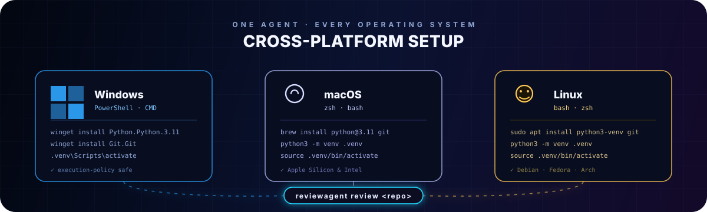
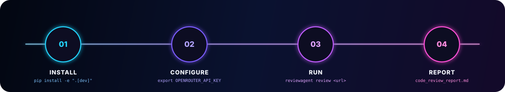

  

  

 

⭐ If this project saves you a code review, consider starring it — it genuinely helps.

 

code-review-agent clones a GitHub repository, walks every Python file, splits oversized files into overlapping line-boundary chunks, sends each chunk through a structured LLM review pipeline (NVIDIA Nemotron 70B via OpenRouter — free — or Anthropic Claude), then aggregates the findings into a single, severity-sorted Markdown report you can interrogate afterward with grounded, per-file follow-up questions.

 

<i>A real run: clone → discover → review → merge → severity signal → report, end to end.</i>

 

📚 Table of Contents

<table>
<tr>
<td width="50%" valign="top">

✨ Features

🏗️ Architecture

⚙️ Requirements

📦 Installation & Setup Guide

🪟 Windows

🍎 macOS

🐧 Linux

🖥️ Run the Web App Locally

</td>
<td width="50%" valign="top">

🔑 Configuration

🚀 Usage

🧪 Testing

📁 Project Structure

🗺️ Roadmap

🤝 Contributing

📄 License

</td>
</tr>
</table>

 

✨ Features

<table>
<tr>
<td width="33%" valign="top">

🆓 Free-Tier First

Native support for NVIDIA Nemotron 70B
(nvidia/llama-3.1-nemotron-70b-instruct:free)
via OpenRouter — zero API cost by default.

</td>
<td width="33%" valign="top">

🔀 Multi-Provider

Seamless fallback to Anthropic Claude
(claude-3-5-sonnet-20241022) when you
need a heavier-weight reviewer.

</td>
<td width="33%" valign="top">

🧩 Lossless Chunking

Line-boundary overlapping sliding windows
— zero split tokens mid-statement, verified
with Hypothesis property-based testing.

</td>
</tr>
<tr>
<td width="33%" valign="top">

🧹 Smart Aggregation

Deduplicates overlapping chunk findings and
sorts files worst-severity-first so the
report reads top-down by urgency.

</td>
<td width="33%" valign="top">

💬 Conversational Follow-ups

Reopen a grounded, multi-turn REPL
session per file — ask "why?" and get
answers anchored to the original review.

</td>
<td width="33%" valign="top">

📝 Clean Markdown Reports

A single, portable .md report — readable
in any editor, renders natively on GitHub,
zero external viewer required.

</td>
</tr>
</table>

 

🏗️ Architecture

flowchart TD
    A(["🔗 GitHub Repository URL"]) --> B["1️⃣ Clone shallow git clone → temp directory"]
    B --> C["2️⃣ Enumerate os.walk · filter *.py · honor .gitignore via pathspec"]
    C --> D["3️⃣ Chunk line-boundary overlapping windows · token-budget proxy"]
    D --> E{"4️⃣ Review Loop"}
    E -->|"free tier"| F["🟢 OpenRouter NVIDIA Nemotron 70B"]
    E -->|"fallback"| G["🟣 Anthropic Claude 3.5 Sonnet"]
    F --> H["5️⃣ Aggregate merge chunk results · dedupe boundary findings"]
    G --> H
    H --> I["6️⃣ Markdown Report ordered worst-severity-first"]
    I --> J(["7️⃣ Interactive Follow-up reopen per-file conversation session"])

    classDef stage fill:#161b22,stroke:#58A6FF,stroke-width:1.5px,color:#c9d1d9,rx:8,ry:8
    classDef terminal fill:#0F2027,stroke:#2ea44f,stroke-width:2px,color:#ffffff,rx:20,ry:20
    classDef decision fill:#21262d,stroke:#D97757,stroke-width:1.5px,color:#c9d1d9
    class A,J terminal
    class B,C,D,H,I stage
    class E decision
    class F,G stage

💡 GitHub renders this diagram natively — no plugins required.

 

⚙️ Requirements

Requirement

Details

🐍 Python

3.11+

🌿 Git

Available on PATH

🔑 API Key

OPENROUTER_API_KEY (free NVIDIA Nemotron 70B) or ANTHROPIC_API_KEY

💻 OS

Windows 10/11 · macOS 12+ (Intel & Apple Silicon) · Any modern Linux distro

 

📦 Installation & Setup Guide

 

Pick your operating system below — each guide is self-contained, from a clean machine to a working reviewagent command.

 

🪟 Windows

<b>Windows 10 / 11 — PowerShell setup</b>

 

1. Install prerequisites (skip anything you already have)

# Using winget (built into Windows 10/11)
winget install --id Python.Python.3.11 -e
winget install --id Git.Git -e

No winget? Download Python from python.org/downloads and Git from git-scm.com instead. During Python setup, check "Add python.exe to PATH."

2. Clone the repository

git clone https://github.com/your-username/code-review-agent.git
cd code-review-agent

3. Create and activate a virtual environment

python -m venv .venv
.venv\Scripts\activate

If activation fails with an execution-policy error, run PowerShell as Administrator once:
Set-ExecutionPolicy -ExecutionPolicy RemoteSigned -Scope CurrentUser

4. Install the package

pip install -e ".[dev]"

5. Verify

reviewagent --help

 

🍎 macOS

<b>macOS 12+ — Intel & Apple Silicon</b>

 

1. Install prerequisites via Homebrew

# Install Homebrew if you don't already have it
/bin/bash -c "$(curl -fsSL https://raw.githubusercontent.com/Homebrew/install/HEAD/install.sh)"

brew install python@3.11 git

2. Clone the repository

git clone https://github.com/your-username/code-review-agent.git
cd code-review-agent

3. Create and activate a virtual environment

python3.11 -m venv .venv
source .venv/bin/activate

4. Install the package

pip install -e ".[dev]"

5. Verify

reviewagent --help

⚙️ Apple Silicon (M1/M2/M3/M4) note: everything here runs natively under arm64 — no Rosetta required for this project's pure-Python dependency set.

 

🐧 Linux

<b>Debian / Ubuntu · Fedora / RHEL · Arch</b>

 

1. Install prerequisites

# Debian / Ubuntu
sudo apt update && sudo apt install -y python3.11 python3.11-venv python3-pip git

# Fedora / RHEL
sudo dnf install -y python3.11 python3-pip git

# Arch
sudo pacman -S python git

2. Clone the repository

git clone https://github.com/your-username/code-review-agent.git
cd code-review-agent

3. Create and activate a virtual environment

python3.11 -m venv .venv
source .venv/bin/activate

4. Install the package

pip install -e ".[dev]"

5. Verify

reviewagent --help

 

 

🖥️ Run the Web App Locally

This project runs as a regular Vite/Express application and does not require AI Studio.

<table>
<tr><th>Windows (PowerShell)</th><th>macOS / Linux</th></tr>
<tr>
<td>

npm install
Copy-Item .env.example .env
npm run dev

</td>
<td>

npm install
cp .env.example .env
npm run dev

</td>
</tr>
</table>

Open http://localhost:3000 in your browser.

⚠️ Put your real GEMINI_API_KEY or OPENROUTER_API_KEY only in .env — .env is git-ignored.
To publish the source on GitHub, commit .env.example, never .env.

 

🔑 Configuration

<b>Option A — OpenRouter Free NVIDIA Nemotron 70B</b> (recommended)

 

# 1. Get a free API key at https://openrouter.ai/keys
export OPENROUTER_API_KEY="sk-or-v1-..."      # macOS / Linux
$env:OPENROUTER_API_KEY = "sk-or-v1-..."      # Windows PowerShell

# Default model is nvidia/llama-3.1-nemotron-70b-instruct:free

<b>Option B — Anthropic Claude</b>

 

export ANTHROPIC_API_KEY="sk-ant-api03-..."   # macOS / Linux
$env:ANTHROPIC_API_KEY = "sk-ant-api03-..."   # Windows PowerShell

 

🚀 Usage

1️⃣ Run a full repository review

# Default uses nvidia/llama-3.1-nemotron-70b-instruct:free via OpenRouter
reviewagent review https://github.com/pallets/click.git

Custom options:

reviewagent review https://github.com/encode/httpx.git \
  --output ./httpx_report.md \
  --model nvidia/llama-3.1-nemotron-70b-instruct:free \
  --max-tokens 3000 \
  --overlap-tokens 300 \
  --keep-clone

<b>📋 Full flag reference</b>

 

Flag

Description

Default

--output, -o

Path to the generated Markdown report

code_review_report.md

--model, -m

LLM model identifier

nvidia/llama-3.1-nemotron-70b-instruct:free / claude-3-5-sonnet-20241022

--provider, -p

Provider override — openrouter or anthropic

auto-detected

--max-tokens

Approximate token budget per chunk before splitting

3000

--overlap-tokens

Overlap budget between adjacent chunks

300

--keep-clone

Retains the cloned repository on disk for inspection

off

--session-dir

Directory storing serialized conversation sessions

.reviewagent_sessions

2️⃣ Ask follow-up questions for a specific file

reviewagent followup "src/httpx/_client.py" \
  "Why is the connection pool cleanup flagged as a leak on line 180?"

 

🧪 Testing

pytest -v

Property-Based Invariant Testing

The chunking engine (src/reviewagent/chunker.py) is verified with Hypothesis in tests/test_chunker.py across hundreds of randomized text streams, guaranteeing three core invariants:

flowchart LR
    A["📏 Line Integrity chunks split strictly on line boundaries"] --> D(["✅ Verified hundreds of random inputs"])
    B["🔢 Order Preservation strict ascending line numbers, no gaps"] --> D
    C["🔁 Lossless Reconstruction trimmed overlaps reproduce original byte-for-byte"] --> D

    classDef inv fill:#161b22,stroke:#58A6FF,stroke-width:1.5px,color:#c9d1d9,rx:8,ry:8
    classDef pass fill:#0F2027,stroke:#2ea44f,stroke-width:2px,color:#ffffff,rx:20,ry:20
    class A,B,C inv
    class D pass

 

📁 Project Structure

code-review-agent/
├── pyproject.toml              # Hatchling build & dependencies (openai, anthropic, typer)
├── README.md                   # Full architecture & CLI manual
├── .env.example                # Environment variables template
├── hero-banner.svg             # Cinematic project banner
├── terminal-demo.svg           # Animated review pipeline demonstration
├── platforms-banner.svg        # Cross-platform installation banner
├── quickstart-flow.svg         # Quick-start workflow visualization
├── src/
│   └── reviewagent/
│       ├── __init__.py
│       ├── config.py           # pydantic-settings (OpenRouter Nemotron + Anthropic)
│       ├── clone.py            # subprocess git clone & tempdir handling
│       ├── discover.py         # os.walk + pathspec .gitignore filtering
│       ├── chunker.py          # line-boundary overlapping window chunker
│       ├── review.py           # Multi-provider LLM review (OpenRouter / Anthropic)
│       ├── conversation.py     # per-file multi-turn conversation store
│       ├── aggregate.py        # merge chunk findings & deduplicate overlap
│       ├── report.py           # Markdown report generator
│       └── cli.py              # Typer CLI (review + followup commands)
├── tests/
│   ├── fixtures/
│   │   └── sample_repo/        # fixture repo for discovery & review tests
│   ├── test_chunker.py         # Hypothesis property-based tests
│   ├── test_discover.py        # unit tests for file discovery & gitignore
│   └── test_aggregate.py       # unit tests for finding deduplication
└── examples/
    └── sample_report.md        # sample generated review report

 

🗺️ Roadmap

Multi-language support beyond Python

JSON / SARIF export for CI integration

GitHub Action for automated PR reviews

Parallel chunk review with rate-limit backoff

Web dashboard for report browsing

 

🤝 Contributing

Contributions, issues, and feature requests are welcome!
Feel free to check the issues page or open a pull request.

# Fork → clone → branch → commit → push → PR
git checkout -b feat/your-feature-name

 

📄 License

Distributed under the MIT License. See LICENSE for details.

 

Built with 🧠 structured LLM reasoning · ✅ property-based testing · 📝 clean Markdown output

